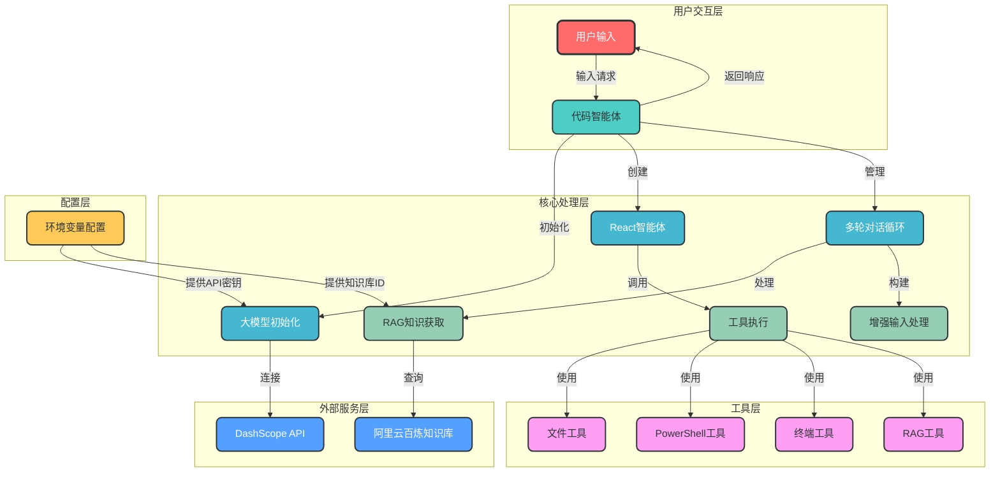

## 2. 架构图 - 代码智能体组件关系

```mermaid
graph TD
    subgraph 用户交互层
        A[用户输入] -->|输入请求| B[代码智能体]
        B -->|返回响应| A
    end

    subgraph 核心处理层
        B -->|初始化| C[大模型初始化]
        B -->|创建| D[React智能体]
        B -->|管理| E[多轮对话循环]
        E -->|处理| F[RAG知识获取]
        E -->|构建| G[增强输入处理]
        D -->|调用| H[工具执行]
    end

    subgraph 工具层
        H -->|使用| I[文件工具]
        H -->|使用| J[PowerShell工具]
        H -->|使用| K[终端工具]
        H -->|使用| L[RAG工具]
    end

    subgraph 外部服务层
        F -->|查询| M[阿里云百炼知识库]
        C -->|连接| N[DashScope API]
    end

    subgraph 配置层
        O[环境变量配置] -->|提供API密钥| C
        O -->|提供知识库ID| F
    end

    %% 样式定义
    classDef style1 fill:#FF6B6B,stroke:#2D3436,stroke-width:3px,color:white,rx:8,ry:8;
    classDef style2 fill:#4ECDC4,stroke:#2D3436,stroke-width:2px,color:#2D3436,rx:8,ry:8;
    classDef style3 fill:#45B7D1,stroke:#2D3436,stroke-width:2px,color:white,rx:8,ry:8;
    classDef style4 fill:#96CEB4,stroke:#2D3436,stroke-width:2px,color:#2D3436,rx:8,ry:8;
    classDef style5 fill:#FF9FF3,stroke:#2D3436,stroke-width:2px,color:#2D3436,rx:8,ry:8;
    classDef style6 fill:#54A0FF,stroke:#2D3436,stroke-width:2px,color:white,rx:8,ry:8;
    classDef style7 fill:#FECA57,stroke:#2D3436,stroke-width:2px,color:#2D3436,rx:8,ry:8;
    classDef style8 fill:#E9ECEF,stroke:#2D3436,stroke-width:3px,color:#2D3436,rx:8,ry:8;

    %% 应用样式
    class A style1;
    class B style2;
    class C,D,E style3;
    class F,G,H style4;
    class I,J,K,L style5;
    class M,N style6;
    class O style7;
```
