# 智能体工具调用与解析器测试流程

## 代码流程分析

`agent_tool_call_with_parsers.py` 是一个使用 LangChain 实现智能体开发流程的示例脚本。主要功能包括：
1. 初始化通义千问大模型
2. 创建加法工具
3. 创建带工具的大模型
4. 执行工具调用并返回结果
5. 测试各种输出解析器

## 执行流程图

```mermaid
graph TD
    subgraph 初始化阶段
        A[开始执行] --> B[初始化大模型<br/>init_llm]
        B --> C[创建工具列表<br/>create_calc_tools]
        C --> D[创建带工具的大模型<br/>create_llm_with_tools]
    end
    
    subgraph 执行阶段
        D --> E[创建提示模板<br/>ChatPromptTemplate]
        E --> F[组装调用链<br/>prompt &#124; llm_with_tools]
        F --> G[调用大模型<br/>chain.invoke]
        G --> H[解析工具调用<br/>execute_tool_call]
        H --> I[执行对应工具]
        I --> J[返回工具执行结果]
        J --> K[打印结果]
        K --> L[测试输出解析器]
        L --> M[测试基础解析器<br/>test_basic_parsers]
        M --> N[测试Pydantic解析器<br/>test_pydantic_parser]
        N --> O[测试完成]
    end
    
    subgraph 工具定义
        P[定义AddInputArgs<br/>参数校验模型] --> Q[定义add函数<br/>加法运算]
        Q --> R[创建加法工具<br/>create_add_tool]
        R --> C
    end
    
    classDef start fill:#FF6B6B,stroke:#2D3436,stroke-width:3px,color:white,rx:8,ry:8
    classDef init fill:#4ECDC4,stroke:#2D3436,stroke-width:2px,color:#2D3436,rx:8,ry:8
    classDef process fill:#45B7D1,stroke:#2D3436,stroke-width:2px,color:white,rx:8,ry:8
    classDef decision fill:#96CEB4,stroke:#2D3436,stroke-width:2px,color:#2D3436,rx:8,ry:8
    classDef tool fill:#FF9FF3,stroke:#2D3436,stroke-width:2px,color:#2D3436,rx:8,ry:8
    classDef output fill:#54A0FF,stroke:#2D3436,stroke-width:2px,color:white,rx:8,ry:8
    classDef endnode fill:#FECA57,stroke:#2D3436,stroke-width:2px,color:#2D3436,rx:8,ry:8
    
    class A start
    class B,C,D init
    class E,F,G,H,I,M,N process
    class P,Q,R tool
    class J,K,L output
    class O endnode
```

## 数据流说明

1. **初始化阶段数据流**：
   - 配置参数 → `init_llm()` → 大模型实例
   - 工具函数 → `create_add_tool()` → 工具对象
   - 工具对象 → `create_calc_tools()` → 工具列表
   - 大模型实例 + 工具列表 → `create_llm_with_tools()` → 带工具的大模型

2. **执行阶段数据流**：
   - 提示模板 + 带工具的大模型 → 调用链
   - 测试用例输入 → `chain.invoke()` → 模型响应
   - 模型响应 → `execute_tool_call()` → 工具调用指令
   - 工具调用指令 → 对应工具函数 → 工具执行结果
   - 工具执行结果 → 打印输出
   - 大模型实例 → 测试各种输出解析器 → 解析结果

3. **工具定义数据流**：
   - 输入参数 → AddInputArgs 校验模型 → add 函数
   - add 函数 → `create_add_tool()` → 工具对象
   - 工具对象 → `create_calc_tools()` → 工具列表

## 核心流程说明

1. **初始化大模型**：创建通义千问大模型实例，配置API密钥和其他参数
2. **创建工具**：将加法函数转换为LangChain工具对象
3. **创建带工具的大模型**：将工具绑定到大模型上
4. **执行调用**：
   - 组装调用链并调用大模型
   - 解析模型返回的工具调用指令
   - 执行对应工具并返回结果
5. **测试输出解析器**：
   - 测试基础输出解析器（StrOutputParser, CommaSeparatedListOutputParser, SimpleJsonOutputParser）
   - 测试Pydantic输出解析器，验证结构化数据解析能力

该流程图清晰展示了从初始化到执行的完整流程，以及各模块之间的数据流向，便于理解代码的整体结构和执行逻辑。