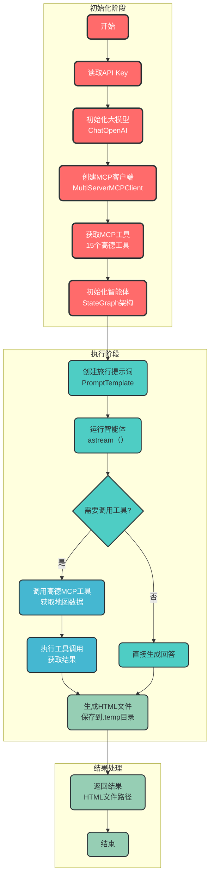

# 高德MCP智能体脚本文档

## 1. 脚本概述

`amap_mcp_agent.py` 是一个使用 LangChain 框架集成高德 MCP (Map Content Platform) 服务的智能体脚本。该脚本能够根据用户需求生成详细的旅行攻略，并将结果保存为精美的 HTML 文件。

### 核心功能

- ✅ 使用 LangChain 最新 StateGraph 架构
- ✅ 集成高德 MCP 服务，获取实时地图数据
- ✅ 自动生成旅行攻略，包含景点、路线、交通方式等
- ✅ 支持多种交通方式（打车、骑行、步行、驾车）
- ✅ 生成可在高德地图 App 中查看的专属行程链接
- ✅ 生成精美的 HTML 格式旅行攻略

## 2. 代码结构与流程

### 2.1 主要组件

| 组件 | 功能 | 位置 |
|------|------|------|
| `init_llm()` | 初始化通义千问大模型 | 第24-33行 |
| `AmapMCPAgent` 类 | 高德MCP智能体核心类 | 第36-168行 |
| `create_mcp_client()` | 创建高德MCP客户端 | 第57-71行 |
| `initialize_agent()` | 初始化智能体 | 第73-98行 |
| `create_travel_prompt()` | 生成旅行攻略提示词 | 第100-133行 |
| `run_agent()` | 运行智能体 | 第135-162行 |
| `main()` | 主函数 | 第171-227行 |

### 2.2 核心流程



## 3. 详细流程说明

### 3.1 初始化阶段

#### 3.1.1 初始化大模型

```python
def init_llm():
    return ChatOpenAI(
        model="qwen-plus",
        base_url="https://dashscope.aliyuncs.com/compatible-mode/v1",
        api_key=SecretStr("sk-9ec27f85396f41788a441841e6d4a718"),
        temperature=0,
        max_tokens=2048
    )
```

**关键参数说明**：
- `model`：使用的大模型名称（通义千问 qwen-plus）
- `base_url`：通义千问兼容 OpenAI 格式的 API 地址
- `api_key`：使用 `SecretStr` 加密存储，保护敏感信息
- `temperature`：生成结果的随机性（0表示确定性输出）

#### 3.1.2 创建高德MCP客户端

```python
async def create_mcp_client():
    self.client = MultiServerMCPClient({
        "amap": {
            "url": f"https://mcp.amap.com/sse?key={self.amap_key}",
            "transport": "sse",
        }
    })
    self.tools = await self.client.get_tools()
```

**关键说明**：
- 使用 `MultiServerMCPClient` 创建高德 MCP 客户端
- 通过 SSE (Server-Sent Events) 协议获取实时数据
- 自动获取 15 个高德 MCP 工具，包括地图搜索、路线规划、天气查询等

#### 3.1.3 初始化智能体

```python
def initialize_agent(self, include_file_tools=False, root_dir=None):
    # 添加文件管理工具
    if include_file_tools:
        # ...
    
    # 使用最新的 create_agent API (基于 StateGraph)
    self.agent = agents.create_agent(
        model=self.llm,
        tools=self.tools,
        system_prompt="你是一个智能助手，可以调用高德 MCP 工具..."
    )
```

**关键说明**：
- 使用 LangChain 最新 `agents.create_agent()` API
- 基于 StateGraph 架构，支持复杂的工作流
- 可选择性添加文件管理工具

### 3.2 执行阶段

#### 3.2.1 创建旅行提示词

```python
def create_travel_prompt(self, travel_info, save_to_file=None):
    base_prompt = """你是一个智能助手，可以调用高德 MCP 工具。
    # ... 提示词模板 ...
    """
    prompt_template = PromptTemplate.from_template(base_prompt)
    return prompt_template.format(**travel_info)
```

**关键说明**：
- 使用 `PromptTemplate` 创建结构化提示词
- 支持动态参数替换
- 可指定结果保存路径

#### 3.2.2 运行智能体

```python
async def run_agent(self, prompt):
    inputs = {"messages": [{"role": "user", "content": prompt}]}
    result = None
    for chunk in self.agent.astream(inputs, stream_mode="updates"):
        if chunk:
            print(chunk)
            result = chunk
    return result
```

**关键说明**：
- 使用异步 `astream()` 方法，支持流式输出
- 处理每个返回的 chunk，实时输出
- 适用于需要实时反馈的场景

### 3.3 结果处理阶段

智能体运行完成后，会生成详细的旅行攻略，并将结果保存为 HTML 文件。生成的 HTML 包含：

- 📅 行程概览
- 🌤️ 天气预报
- 🗺️ 专属行程地图链接
- 🚖 打车直达链接
- 🚲 骑行、步行、驾车路线

## 4. 数据流详细说明

```mermaid
flowchart TD
    subgraph 配置层
        A[API Key
高德/大模型] --> B[配置信息]
    end
    
    subgraph 核心层
        B --> C[大模型
ChatOpenAI]
        B --> D[MCP客户端
MultiServerMCPClient]
        D --> E[MCP工具
15个高德工具]
        C --> F[智能体
StateGraph架构]
        E --> F
    end
    
    subgraph 输入层
        G[旅行信息
时间/目的地/天数/交通] --> H[提示词
PromptTemplate]
    end
    
    subgraph 执行层
        H --> I[智能体调用
astream()]
        I --> J{调用工具?}
        J -->|是| K[MCP工具调用
地图搜索/路线规划]
        K --> L[工具结果
JSON数据]
        J -->|否| L
        L --> M[生成HTML
精美页面]
    end
    
    subgraph 输出层
        M --> N[HTML文件
.temp/amap.html]
        N --> O[结果返回
文件路径]
    end
    
    classDef configStyle fill:#FF6B6B,stroke:#2D3436,stroke-width:3px,color:white,rx:8,ry:8
    classDef coreStyle fill:#4ECDC4,stroke:#2D3436,stroke-width:2px,color:#2D3436,rx:8,ry:8
    classDef inputStyle fill:#45B7D1,stroke:#2D3436,stroke-width:2px,color:white,rx:8,ry:8
    classDef execStyle fill:#96CEB4,stroke:#2D3436,stroke-width:2px,color:#2D3436,rx:8,ry:8
    classDef outputStyle fill:#FF9FF3,stroke:#2D3436,stroke-width:2px,color:#2D3436,rx:8,ry:8
    
    class A,B configStyle
    class C,D,E,F coreStyle
    class G,H inputStyle
    class I,J,K,L,M execStyle
    class N,O outputStyle
```

## 5. 核心技术点

### 5.1 LangChain StateGraph 架构

LangChain 最新的 StateGraph 架构是一种基于状态机的智能体设计模式，具有以下优势：

- 🔄 支持复杂的工作流和状态转换
- 🧠 更灵活的工具调用机制
- ⚡ 更高的执行效率
- 📊 更好的可观测性和调试能力

### 5.2 高德 MCP 服务

高德 MCP 服务提供了丰富的地图相关工具：

| 工具类型 | 示例功能 |
|----------|----------|
| 地图搜索 | 景点查询、地址搜索 |
| 路线规划 | 打车、骑行、步行、驾车路线 |
| 天气查询 | 实时天气、天气预报 |
| 地图绘制 | 自定义地图、路线绘制 |

### 5.3 异步编程模型

脚本大量使用异步编程：

- ✅ 异步创建 MCP 客户端
- ✅ 异步运行智能体
- ✅ 异步处理工具调用

这种设计提高了脚本的并发处理能力和响应速度，适合处理 I/O 密集型任务。

## 6. 使用方法

### 6.1 直接运行

```bash
python amap_mcp_agent.py
```

### 6.2 作为模块导入

```python
from app.bailian.amap_mcp_agent import AmapMCPAgent, init_llm

# 初始化大模型
llm = init_llm()

# 创建智能体
agent = AmapMCPAgent(amap_key="your-api-key", llm=llm)

# 生成攻略
# ...
```

### 6.3 自定义配置

可以通过修改 `main()` 函数中的参数来自定义旅行信息：

```python
travel_info = {
    "time": "五一假期",
    "destination": "北京",
    "days": 5,
    "transport": "公共交通",
}
```

## 7. 结果示例

运行脚本后，将在 `E:\github_project\imooc_agent\.temp\amap.html` 生成精美的旅行攻略页面，包含：

- 🎉 行程标题和简介
- 🌤️ 天气预报信息
- 📅 每日行程安排
- 📍 各景点详细信息
- 🚖 打车直达链接
- 🗺️ 高德地图专属行程链接

## 8. 代码优化建议

### 8.1 添加日志系统

建议添加专业的日志系统，便于调试和监控：

```python
import logging
logging.basicConfig(level=logging.INFO)
logger = logging.getLogger(__name__)

# 在关键步骤添加日志
logger.info("大模型初始化完成")
```

### 8.2 增加错误重试机制

对网络请求和工具调用添加重试机制：

```python
from tenacity import retry, stop_after_attempt, wait_fixed

@retry(stop=stop_after_attempt(3), wait=wait_fixed(1))
async def create_mcp_client(self):
    # ...
```

### 8.3 支持更多输出格式

除了 HTML，还可以支持 PDF、Markdown 等格式：

```python
def save_result(result, format="html", save_path):
    if format == "html":
        # 生成HTML
    elif format == "markdown":
        # 生成Markdown
    # ...
```

## 9. 总结

`amap_mcp_agent.py` 是一个功能完整、架构先进的智能体脚本，展示了 LangChain 最新 StateGraph 架构的强大能力。通过集成高德 MCP 服务，该脚本能够生成高质量的旅行攻略，具有以下特点：

- 🛠️ 使用最新技术栈
- 📱 集成实时地图数据
- 🎨 生成精美 HTML 页面
- ⚡ 异步高效执行
- 🔧 易于扩展和定制

该脚本可以作为 LangChain 智能体开发的参考模板，也可以直接用于生成旅行攻略，具有很高的实用价值和学习价值。
