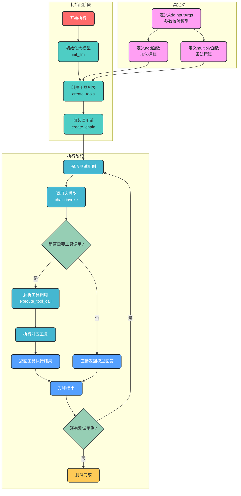

# 通义千问工具调用执行流程图

## 代码流程分析

`bailian_tool_call.py` 是一个使用 LangChain 调用通义千问大模型并绑定自定义工具的示例脚本。主要功能包括：
1. 初始化通义千问大模型
2. 创建加法和乘法工具
3. 组装大模型调用链
4. 解析工具调用并执行
5. 测试不同类型的用户输入

## 执行流程图

## 数据流说明

1. **初始化阶段数据流**：
   - 配置参数 → `init_llm()` → 大模型实例
   - 工具函数 → `create_tools()` → 工具列表
   - 大模型实例 + 工具列表 → `create_chain()` → 调用链

2. **执行阶段数据流**：
   - 测试用例输入 → `chain.invoke()` → 模型响应
   - 模型响应 → `execute_tool_call()` → 工具调用指令/直接回答
   - 工具调用指令 → 对应工具函数 → 工具执行结果
   - 工具执行结果/直接回答 → 打印输出

3. **工具定义数据流**：
   - 输入参数 → 参数校验模型 → 工具函数
   - 工具函数 → 工具对象 → 工具列表

## 核心流程说明

1. **初始化大模型**：创建通义千问大模型实例，配置API密钥和其他参数
2. **创建工具**：将加法和乘法函数转换为LangChain工具对象
3. **组装调用链**：将提示词模板与大模型绑定，形成完整的调用链
4. **执行调用**：
   - 对于需要计算的请求，大模型会调用相应的工具
   - 对于不需要计算的请求，大模型直接回答
5. **结果处理**：解析工具调用结果或直接返回模型回答

该流程图清晰展示了从初始化到执行的完整流程，以及各模块之间的数据流向，便于理解代码的整体结构和执行逻辑。