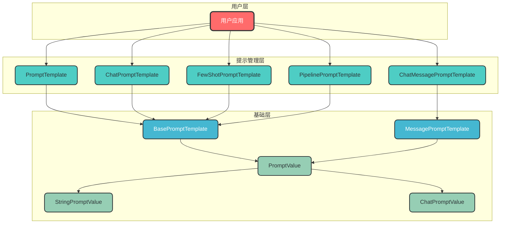
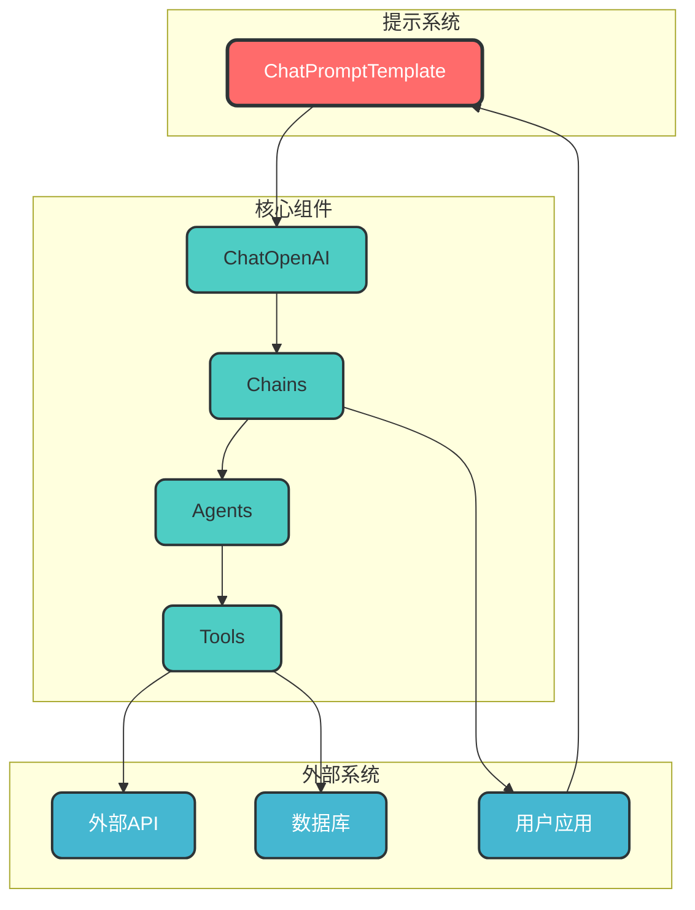

# LangChain Prompts 核心库详解

## 1. 概述

LangChain Prompts 核心库是 LangChain 框架中负责管理和优化大语言模型（LLM）输入的关键模块，位于 `langchain-core` 包中。它提供了一套标准化的工具和接口，用于构建、管理和优化提示词，从而提升模型生成结果的质量和一致性。

### 1.1 核心价值

| 价值 | 描述 |
|------|------|
| **标准化输入** | 提供统一的提示词构建接口，确保输入格式一致性 |
| **参数化模板** | 支持动态变量替换，增强提示词的灵活性 |
| **多格式支持** | 适配不同类型模型的输入需求（文本、聊天等） |
| **优化机制** | 提供提示词优化工具，提升生成质量 |
| **可重用性** | 支持提示词模板的抽象和复用 |

## 2. 架构与核心组件

### 2.1 组件架构



### 2.2 核心组件说明

| 组件 | 描述 | 适用场景 |
|------|------|----------|
| **BasePromptTemplate** | 所有提示模板的抽象基类 | 自定义提示模板开发 |
| **PromptTemplate** | 文本提示模板，适用于文本补全模型 | 单轮文本生成任务 |
| **ChatPromptTemplate** | 聊天提示模板，适用于聊天模型 | 多轮对话、角色扮演 |
| **FewShotPromptTemplate** | 少样本提示模板，包含示例 | 复杂任务引导、风格统一 |
| **ChatMessagePromptTemplate** | 单个聊天消息的模板 | 消息级别的抽象和复用 |
| **PipelinePromptTemplate** | 流水线提示模板，组合多个模板 | 复杂提示词构建 |
| **PromptValue** | 提示值的抽象基类 | 类型适配和转换 |
| **StringPromptValue** | 字符串形式的提示值 | 文本模型输入 |
| **ChatPromptValue** | 聊天消息列表形式的提示值 | 聊天模型输入 |

## 3. 提示模板类型详解

### 3.1 PromptTemplate（文本提示模板）

**适用场景**：
- 用于**文本补全模型**，输入是纯文本（单字符串）
- 适用于简单的任务，例如生成一段文本、回答问题或执行指令

**核心特性**：
- **输入变量插值**：通过 `{}` 占位符动态替换变量
- **模板格式**：支持 `f-string` 风格的模板语法
- **输出形式**：生成一个完整的字符串作为模型输入

**代码示例**：

```python
from langchain_core.prompts import PromptTemplate

# 创建文本提示模板
template = "请将以下英文翻译成中文：{text}"
prompt_template = PromptTemplate.from_template(template)

# 格式化提示
formatted_prompt = prompt_template.format(text="Hello, world!")
print(formatted_prompt)
# 输出: 请将以下英文翻译成中文：Hello, world!
```

### 3.2 ChatPromptTemplate（聊天提示模板）

**适用场景**：
- 用于**聊天模型**（如 ChatGPT、通义千问等）
- 输入是多轮对话的消息列表（`SystemMessage`、`HumanMessage`、`AIMessage` 等）
- 适用于需要模拟多轮对话或角色扮演的场景

**核心特性**：
- **多消息类型支持**：可以组合系统指令、用户输入和助手回复
- **消息格式化**：生成结构化的消息列表，供聊天模型处理
- **灵活性**：支持动态替换变量（如 `SystemMessage` 中的占位符）

**代码示例**：

```python
from langchain_core.prompts import ChatPromptTemplate

# 创建聊天提示模板
prompt = ChatPromptTemplate.from_messages([
    ("system", "你是一位{role}专家，擅长回答{domain}领域的问题。"),
    ("human", "用户问题：{question}"),
    ("ai", "我会尽力为您解答{domain}相关的问题。")
])

# 格式化消息
formatted_messages = prompt.format_messages(
    role="技术",
    domain="Web开发",
    question="如何构建一个基于Vue的前端应用？"
)

print(formatted_messages)
"""
输出:
[
  SystemMessage(content='你是一位技术专家，擅长回答Web开发领域的问题。'),
  HumanMessage(content='用户问题：如何构建一个基于Vue的前端应用？'),
  AIMessage(content='我会尽力为您解答Web开发相关的问题。')
]
"""
```

### 3.3 FewShotPromptTemplate（少样本提示模板）

**适用场景**：
- 用于**少样本学习**（Few-Shot Learning），在提示中包含示例
- 适用于复杂任务（如翻译、分类、推理），需要通过示例引导模型行为

**核心特性**：
- **示例嵌入**：通过 `examples` 参数提供示例输入和输出
- **动态示例选择**：支持 `ExampleSelector` 动态选择最相关的示例
- **模板格式**：通常包含前缀（Prefix）、示例（Examples）和后缀（Suffix）

**代码示例**：

```python
from langchain_core.prompts import FewShotPromptTemplate, PromptTemplate

# 定义示例模板
example_template = "输入: {input}\n输出: {output}"
example_prompt = PromptTemplate.from_template(example_template)

# 创建示例
examples = [
    {"input": "将'Hello'翻译成中文", "output": "你好"},
    {"input": "将'Goodbye'翻译成中文", "output": "再见"},
    {"input": "将'Thank you'翻译成中文", "output": "谢谢"}
]

# 创建少样本模板
few_shot_prompt = FewShotPromptTemplate(
    examples=examples,
    example_prompt=example_prompt,
    prefix="请将以下英文翻译成中文：",
    suffix="输入: {text}\n输出:",
    input_variables=["text"]
)

# 格式化提示
formatted_prompt = few_shot_prompt.format(text="Welcome")
print(formatted_prompt)
"""
输出:
请将以下英文翻译成中文：

输入: 将'Hello'翻译成中文
输出: 你好

输入: 将'Goodbye'翻译成中文
输出: 再见

输入: 将'Thank you'翻译成中文
输出: 谢谢

输入: Welcome
输出:
"""
```

### 3.4 ChatMessagePromptTemplate（聊天消息提示模板）

**适用场景**：
- 用于创建可重用的聊天消息模板
- 结合 `ChatPromptTemplate` 使用，同时对提示词模板和消息体进行抽象和复用

**核心特性**：
- **消息类型明确**：指定消息的角色（system、human、ai 等）
- **模板化消息**：支持消息内容的参数化
- **可组合性**：可以与其他提示模板组合使用

**代码示例**：

```python
from langchain_core.prompts import ChatMessagePromptTemplate, ChatPromptTemplate

# 创建系统消息模板
system_template = ChatMessagePromptTemplate.from_template(
    template="你是一位{role}专家，擅长回答{domain}领域的问题。",
    role="system",
)

# 创建用户消息模板
human_template = ChatMessagePromptTemplate.from_template(
    template="用户问题：{question}",
    role="human",
)

# 组合消息模板
chat_prompt = ChatPromptTemplate.from_messages([
    system_template,
    human_template,
])

# 格式化消息
messages = chat_prompt.format_messages(
    role="技术",
    domain="Web开发",
    question="如何构建一个基于Vue的前端应用？"
)

print(messages)
"""
输出:
[
  ChatMessage(content='你是一位技术专家，擅长回答Web开发领域的问题。', role='system'),
  ChatMessage(content='用户问题：如何构建一个基于Vue的前端应用？', role='human')
]
"""
```

## 3. 工作流程与数据流

### 3.1 提示词构建与执行流程

```mermaid
graph TD
    A[用户应用] --> B[创建提示模板]
    B --> C[定义模板内容与变量]
    C --> D[格式化提示词]
    D --> E[生成PromptValue]
    E --> F[适配模型输入格式]
    F --> G[调用语言模型]
    G --> H[处理模型响应]
    H --> I[返回结果给用户]
    
    classDef start fill:#FF6B6B,stroke:#2D3436,stroke-width:3px,color:white,rx:8,ry:8
    classDef process fill:#4ECDC4,stroke:#2D3436,stroke-width:2px,color:#2D3436,rx:8,ry:8
    classDef transform fill:#45B7D1,stroke:#2D3436,stroke-width:2px,color:white,rx:8,ry:8
    classDef model fill:#96CEB4,stroke:#2D3436,stroke-width:2px,color:#2D3436,rx:8,ry:8
    classDef end fill:#FECA57,stroke:#2D3436,stroke-width:2px,color:#2D3436,rx:8,ry:8
    
    class A start
    class B,C,D process
    class E,F transform
    class G model
    class H,I end
```

### 3.2 数据流说明

| 阶段 | 数据类型 | 转换过程 | 示例 |
|------|----------|----------|------|
| **模板定义** | 字符串模板 | 创建 `BasePromptTemplate` 实例 | `template = "请翻译：{text}"` |
| **变量注入** | 字典 | 替换模板中的变量 | `{"text": "Hello"}` |
| **提示生成** | `PromptValue` | 生成模型可接受的输入格式 | `StringPromptValue(text="请翻译：Hello")` |
| **模型调用** | 模型特定格式 | 转换为模型API要求的格式 | 文本字符串或消息列表 |
| **响应处理** | 模型响应对象 | 解析和提取响应内容 | `response.content` |

## 4. 高级特性与最佳实践

### 4.1 提示词优化

#### 4.1.1 提示词工程技巧

| 技巧 | 描述 | 适用场景 |
|------|------|----------|
| **明确指令** | 使用清晰、具体的指令 | 所有任务类型 |
| **示例引导** | 提供高质量示例 | 复杂任务、少样本学习 |
| **格式约束** | 明确指定输出格式 | 结构化输出、代码生成 |
| **上下文管理** | 合理控制上下文长度 | 多轮对话、长文本处理 |
| **温度调节** | 根据任务调整温度参数 | 创意生成 vs 事实回答 |

#### 4.1.2 代码示例：结构化输出提示

```python
from langchain_core.prompts import PromptTemplate

# 创建结构化输出提示模板
template = """
请将以下信息转换为JSON格式：
姓名: {name}
年龄: {age}
职业: {occupation}

要求：
1. 输出必须是有效的JSON
2. 包含以下字段：name, age, occupation
3. 不要包含任何额外内容
"""

prompt_template = PromptTemplate.from_template(template)

# 格式化提示
formatted_prompt = prompt_template.format(
    name="张三",
    age="30",
    occupation="工程师"
)

print(formatted_prompt)
"""
输出:
请将以下信息转换为JSON格式：
姓名: 张三
年龄: 30
职业: 工程师

要求：
1. 输出必须是有效的JSON
2. 包含以下字段：name, age, occupation
3. 不要包含任何额外内容
"""
```

### 4.2 提示词复用与抽象

#### 4.2.1 模块化提示词设计

```python
from langchain_core.prompts import ChatPromptTemplate, ChatMessagePromptTemplate

# 定义可复用的系统提示模板
system_template = ChatMessagePromptTemplate.from_template(
    template="你是{role}，{description}",
    role="system",
)

# 定义可复用的用户提示模板
human_template = ChatMessagePromptTemplate.from_template(
    template="用户问题：{question}",
    role="human",
)

# 组合模板创建特定场景的提示
def create_support_prompt():
    """创建技术支持场景的提示"""
    return ChatPromptTemplate.from_messages([
        system_template,
        human_template,
    ])

# 使用模板
support_prompt = create_support_prompt()
formatted_messages = support_prompt.format_messages(
    role="技术支持专家",
    description="擅长解决软件使用问题，提供清晰的步骤指导",
    question="如何重置密码？"
)

print(formatted_messages)
```

### 4.3 性能优化

| 优化策略 | 描述 | 效果 |
|----------|------|------|
| **模板缓存** | 缓存常用提示模板 | 减少重复创建开销 |
| **变量预计算** | 预计算固定部分的提示 | 加速格式化过程 |
| **批量处理** | 批量生成提示词 | 提高处理效率 |
| **模板压缩** | 优化提示词长度 | 减少API调用成本 |

## 5. 集成与实际应用

### 5.1 与其他LangChain组件集成



### 5.2 实际应用示例

#### 5.2.1 工具调用提示设计

```python
from langchain_core.prompts import ChatPromptTemplate
from langchain_openai import ChatOpenAI
from langchain_core.tools import StructuredTool
from pydantic import BaseModel, Field

# 定义工具输入模型
class CalculatorInput(BaseModel):
    """计算器工具的输入参数"""
    a: float = Field(description="第一个数字")
    b: float = Field(description="第二个数字")
    operation: str = Field(description="操作类型：add, subtract, multiply, divide")

# 定义工具函数
def calculator(a: float, b: float, operation: str) -> float:
    """执行基本数学运算"""
    if operation == "add":
        return a + b
    elif operation == "subtract":
        return a - b
    elif operation == "multiply":
        return a * b
    elif operation == "divide":
        return a / b
    else:
        raise ValueError(f"不支持的操作: {operation}")

# 创建工具
calculator_tool = StructuredTool.from_function(
    func=calculator,
    name="calculator",
    description="执行基本数学运算，支持加减乘除",
    args_schema=CalculatorInput,
    return_direct=True,
)

# 创建提示模板
prompt = ChatPromptTemplate.from_messages([
    ("system", """你是一个智能助手，能够使用工具解决问题。
当用户提出需要计算的问题时，请使用calculator工具进行计算。
请直接返回计算结果，不要添加额外的解释。"""),
    ("human", "{input}"),
])

# 初始化模型并绑定工具
llm = ChatOpenAI(model="gpt-3.5-turbo")
llm_with_tool = llm.bind_tools([calculator_tool])

# 组装调用链
chain = prompt | llm_with_tool

# 测试
response = chain.invoke({"input": "计算 100 + 200"})
print(response)
```

#### 5.2.2 多轮对话提示设计

```python
from langchain_core.prompts import ChatPromptTemplate
from langchain_core.messages import HumanMessage, AIMessage, SystemMessage

# 创建多轮对话提示模板
prompt = ChatPromptTemplate.from_messages([
    SystemMessage(content="你是一个专业的客服助手，负责解答用户关于产品的问题。"),
    HumanMessage(content="{user_input_1}"),
    AIMessage(content="{ai_response_1}"),
    HumanMessage(content="{user_input_2}"),
])

# 格式化提示
formatted_messages = prompt.format_messages(
    user_input_1="你们的产品有什么特点？",
    ai_response_1="我们的产品具有高性能、易用性和可靠性三大特点。",
    user_input_2="能详细介绍一下高性能的具体表现吗？"
)

print(formatted_messages)
"""
输出:
[
    SystemMessage(content='你是一个专业的客服助手，负责解答用户关于产品的问题。'),
    HumanMessage(content='你们的产品有什么特点？'),
    AIMessage(content='我们的产品具有高性能、易用性和可靠性三大特点。'),
    HumanMessage(content='能详细介绍一下高性能的具体表现吗？')
]
"""
```

## 6. 常见问题与解决方案

| 问题 | 原因 | 解决方案 |
|------|------|----------|
| **提示词过长** | 超出模型上下文窗口 | 1. 优化提示词长度<br>2. 使用摘要技术<br>3. 调整模型参数 |
| **生成质量差** | 提示词设计不当 | 1. 提供更清晰的指令<br>2. 添加示例<br>3. 明确输出格式 |
| **变量替换失败** | 变量名不匹配 | 1. 检查变量名一致性<br>2. 使用 `input_variables` 验证<br>3. 调试模板格式化过程 |
| **工具调用失败** | 工具描述不清晰 | 1. 优化工具描述<br>2. 提供使用示例<br>3. 明确参数格式 |
| **多轮对话上下文丢失** | 记忆管理不当 | 1. 使用 `Memory` 组件<br>2. 合理控制上下文窗口<br>3. 实现摘要机制 |

## 7. 总结与未来展望

LangChain Prompts 核心库为大语言模型应用开发提供了一套强大、灵活的提示词管理系统。通过标准化的接口和丰富的模板类型，它使开发者能够更高效地构建、管理和优化提示词，从而提升模型生成结果的质量和一致性。

### 7.1 核心优势

1. **标准化**：提供统一的提示词构建接口，简化开发流程
2. **灵活性**：支持多种提示词类型，适配不同场景需求
3. **可扩展性**：模块化设计，易于扩展和定制
4. **优化能力**：内置提示词优化工具，提升生成质量
5. **生态集成**：与LangChain其他组件无缝集成

### 7.2 未来发展趋势

1. **自动化提示优化**：结合机器学习技术，自动优化提示词
2. **多模态提示**：支持文本、图像、音频等多模态输入
3. **智能上下文管理**：更智能的上下文选择和管理机制
4. **行业特定模板**：针对不同行业的专业提示词模板库
5. **协作式提示工程**：支持团队协作的提示词管理系统

LangChain Prompts 核心库不仅是构建大语言模型应用的实用工具，也是提示词工程领域的重要参考实现。随着大语言模型技术的不断发展，它将继续演进，为开发者提供更强大、更智能的提示词管理能力。