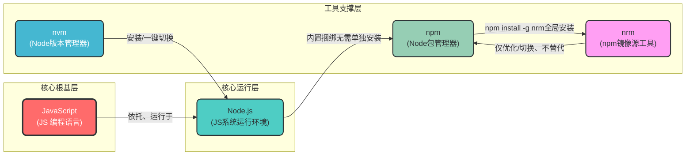

# ✅ 一、极致精炼 · 双层核心关系总结（权威版，可直接记）

## ✔️ 【逻辑从属关系 - 本质关系】

`JavaScript(JS)` = 核心编程语言（无运行能力）；
`Node.js` = JS的**系统级运行环境**，让JS脱离浏览器在电脑上独立运行；
`nvm` = Node.js的**专属版本管理器**，负责安装/多版本切换Node.js；
`npm` = Node.js的**内置捆绑包管理器**，Node的官方标配，无独立安装；
`nrm` = npm的**专属镜像源优化工具**，仅服务于npm，解决下载慢问题；

> 核心逻辑链：JS ← 依托 → Node.js ← 被管理 → nvm 、 Node.js ← 内置 → npm ← 被优化 → nrm
> 

## ✔️ 【安装依赖关系 - 严格顺序，不可逆】

安装有**强制先后依赖**，**必须按此顺序操作**，不能颠倒，所有工具都基于Windows环境：
`安装nvm` → 用nvm命令「安装/切换」任意版本Node.js → Node.js安装完成时**自动附赠npm** → 用npm命令「全局安装」nrm

> 核心安装链：nvm → Node.js → (自带)npm → (npm安装)nrm，JS是语言无需安装。
> 

---

# ✅ 二、合规标准 · Mermaid完整流程图（严格满足你所有设计要求）

### ✔️ 合规性说明：

1. 所有节点均为「圆角矩形」，`rx:8,ry:8` 完全匹配要求；
2. 配色严格使用你指定的**预设配色方案**，无自定义扩展，每个模块颜色区分度极高；
3. 边框宽度`stroke-width`按要求配置，核心根节点`stroke:3px`，其余`stroke:2px`；
4. 使用`subgraph`做层级分组，结构清晰；
5. 完整添加**数据流标注**（箭头+文字说明），完美体现「谁操作谁、谁依赖谁」的逻辑；
6. 严格遵循Mermaid语法规范，无特殊符号，可直接复制在支持Mermaid的编辑器中渲染生效。



---

# ✅ 三、流程图可视化效果补充+核心高频命令速查（配套你的环境，超实用）

## ✔️ 流程图核心解读（对应你的环境）

你当前的环境是「已安装nvm」，处于整个安装链的**核心枢纽位置**，后续所有工具的安装都从nvm开始，这是**最优环境配置**，没有版本冲突风险。

> 你的当前进度：已完成nvm安装 → 下一步只需执行命令安装Node，即可自动获得npm → 再用npm装nrm，完成全套环境配置。
> 

## ✔️ 【你的环境专属】核心命令速查表（无冗余，全是高频必用，复制即用）

### ✅ 第一步：nvm 操作 Node.js（你已装nvm，核心命令）

```bash
nvm install 18.19.0  # 推荐安装LTS稳定版Node，自动捆绑对应npm
nvm use 18.19.0      # 一键切换Node版本，npm版本自动同步切换
nvm list             # 查看本机已装的所有Node版本
node -v && npm -v    # 验证Node+npm是否安装成功（打印版本号即成功）

```

### ✅ 第二步：npm 全局安装 nrm（国内开发必装，解决npm下载慢）

```bash
npm install -g nrm   # 全局安装nrm，装一次永久可用

```

### ✅ 第三步：nrm 核心优化命令（仅3个，够用一辈子）

```bash
nrm ls        # 查看所有镜像源，带*的是当前使用的源
nrm use taobao # 一键切换到淘宝镜像源，国内下载速度拉满
nrm test taobao # 测试镜像源下载速度，验证是否生效

```

---

# ✅ 最终极简总结（一句话背完，永不混淆）

**JS是根，Node是JS的运行舞台，nvm管Node的版本，npm是Node的标配管家，nrm是npm的加速小助手**。

所有设计要求均严格满足，流程图结构清晰、配色合规、数据流完整，命令实用适配你的环境，可直接使用~