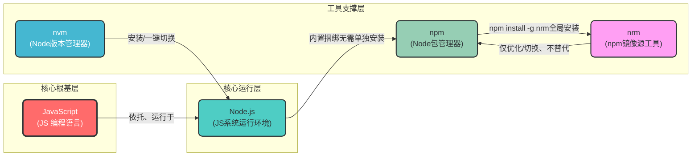

# JavaScript 生态系统核心组件指南

## 1. 引言

本文档详细介绍 JavaScript 生态系统中的核心组件：JavaScript、Node.js、nvm、npm 和 nrm，包括它们之间的关系、安装顺序、使用方法和最佳实践。

## 2. 核心组件关系

### 2.1 逻辑从属关系

| 组件 | 全称 | 功能 | 关系 |
|------|------|------|------|
| JavaScript | - | 核心编程语言 | 依托 Node.js 运行 |
| Node.js | JavaScript Runtime Environment | JS 系统级运行环境 | 内置 npm，被 nvm 管理 |
| nvm | Node Version Manager | Node.js 版本管理器 | 安装/切换 Node.js 版本 |
| npm | Node Package Manager | Node.js 包管理器 | 内置捆绑于 Node.js，被 nrm 优化 |
| nrm | npm Registry Manager | npm 镜像源工具 | 优化 npm 下载速度 |

**核心逻辑链**：
```
JavaScript ← 依托 → Node.js ← 被管理 → nvm
Node.js ← 内置 → npm ← 被优化 → nrm
```

### 2.2 安装依赖关系

安装必须遵循**严格顺序**，不可逆：

```mermaid
graph LR
    %% 定义节点样式
    A["安装 nvm"]:::nodeManager
    B["使用 nvm 安装 Node.js"]:::runtimeEnv
    C["Node.js 自动附赠 npm"]:::pkgManager
    D["使用 npm 安装 nrm"]:::mirrorManager

    %% 核心数据流关系
    A -- 执行 --> B
    B -- 安装完成 --> C
    C -- 执行命令 --> D

    %% 样式定义（与下方图表保持一致）
    classDef rootLang fill:#FF6B6B,stroke:#2D3436,stroke-width:3px,color:white,rx:8,ry:8
    classDef runtimeEnv fill:#4ECDC4,stroke:#2D3436,stroke-width:2px,color:#2D3436,rx:8,ry:8
    classDef nodeManager fill:#45B7D1,stroke:#2D3436,stroke-width:2px,color:white,rx:8,ry:8
    classDef pkgManager fill:#96CEB4,stroke:#2D3436,stroke-width:2px,color:#2D3436,rx:8,ry:8
    classDef mirrorManager fill:#FF9FF3,stroke:#2D3436,stroke-width:2px,color:#2D3436,rx:8,ry:8
```



**安装命令序列**：
```bash
# 1. 安装 nvm（Windows 环境）
# 下载安装包：https://github.com/coreybutler/nvm-windows/releases

# 2. 使用 nvm 安装 Node.js
nvm install 18.19.0

# 3. 切换到安装的 Node.js 版本
nvm use 18.19.0

# 4. 验证 Node.js 和 npm 安装
node -v && npm -v

# 5. 安装 nrm
npm install -g nrm
```

## 3. 可视化流程图

### 3.1 Mermaid 完整流程图



### 3.2 流程图解读

1. **核心根基层**：JavaScript 作为核心编程语言，是整个生态系统的基础
2. **核心运行层**：Node.js 提供了 JavaScript 的运行环境，使其能够脱离浏览器运行
3. **工具支撑层**：
   - nvm：管理 Node.js 版本，实现多版本切换
   - npm：Node.js 内置的包管理器，用于安装和管理依赖
   - nrm：优化 npm 镜像源，提高下载速度

## 4. 核心命令速查

### 4.1 nvm 命令

| 命令 | 功能 |
|------|------|
| `nvm install <version>` | 安装指定版本的 Node.js |
| `nvm use <version>` | 切换到指定版本的 Node.js |
| `nvm list` | 查看已安装的所有 Node.js 版本 |
| `nvm uninstall <version>` | 卸载指定版本的 Node.js |
| `nvm current` | 查看当前使用的 Node.js 版本 |

### 4.2 npm 命令

| 命令 | 功能 |
|------|------|
| `npm install <package>` | 安装指定包（本地） |
| `npm install -g <package>` | 全局安装指定包 |
| `npm uninstall <package>` | 卸载指定包 |
| `npm update <package>` | 更新指定包 |
| `npm init` | 初始化 npm 项目 |
| `npm run <script>` | 运行 package.json 中定义的脚本 |

### 4.3 nrm 命令

| 命令 | 功能 |
|------|------|
| `nrm ls` | 查看所有可用镜像源 |
| `nrm use <registry>` | 切换到指定镜像源 |
| `nrm test <registry>` | 测试指定镜像源的响应速度 |
| `nrm add <name> <url>` | 添加自定义镜像源 |
| `nrm del <name>` | 删除自定义镜像源 |

## 5. 代码示例

### 5.1 环境检查脚本

```javascript
// check_env.js
const { execSync } = require('child_process');

function executeCommand(cmd) {
    try {
        return execSync(cmd, { encoding: 'utf-8' }).trim();
    } catch (error) {
        return `Error: ${error.message}`;
    }
}

console.log('=== 环境检查结果 ===');
console.log(`Node.js 版本: ${executeCommand('node -v')}`);
console.log(`npm 版本: ${executeCommand('npm -v')}`);
console.log(`nvm 版本: ${executeCommand('nvm -v')}`);
console.log(`当前使用的 npm 镜像源: ${executeCommand('npm config get registry')}`);
```

运行脚本：
```bash
node check_env.js
```

### 5.2 版本切换示例

```bash
# 查看已安装的 Node.js 版本
nvm list

# 安装最新 LTS 版本
nvm install --lts

# 切换到最新 LTS 版本
nvm use --lts

# 验证版本切换结果
node -v && npm -v
```

## 6. 最佳实践

1. **始终使用 nvm 管理 Node.js 版本**：避免全局安装 Node.js，便于多版本切换
2. **使用 LTS 版本**：生产环境建议使用 Long Term Support (LTS) 版本，更稳定可靠
3. **定期更新依赖**：使用 `npm update` 或 `npm outdated` 检查并更新依赖
4. **使用合适的镜像源**：根据网络环境选择合适的 npm 镜像源，提高下载速度
5. **创建 .nvmrc 文件**：在项目根目录创建 .nvmrc 文件，指定项目所需的 Node.js 版本

### .nvmrc 文件示例

```
18.19.0
```

使用方法：
```bash
# 进入项目目录
cd /path/to/project

# 自动切换到 .nvmrc 指定的版本
nvm use
```

## 7. 常见问题与解决方案

### 7.1 nvm 安装失败

**问题**：安装 nvm 后，命令行提示 "nvm 不是内部或外部命令"

**解决方案**：
1. 检查环境变量是否正确配置
2. 重启命令行窗口
3. 重新安装 nvm

### 7.2 npm 下载速度慢

**问题**：使用默认镜像源下载依赖时速度很慢

**解决方案**：
```bash
# 安装 nrm
npm install -g nrm

# 查看可用镜像源
nrm ls

# 切换到淘宝镜像源
nrm use taobao
```

### 7.3 版本切换失败

**问题**：使用 `nvm use <version>` 后，Node.js 版本未切换

**解决方案**：
1. 以管理员身份运行命令行窗口
2. 检查指定版本是否已安装
3. 重启命令行窗口

## 8. 总结

JavaScript 生态系统中的核心组件（JavaScript、Node.js、nvm、npm、nrm）之间存在着明确的逻辑从属关系和安装依赖关系。通过 nvm 管理 Node.js 版本，使用 npm 安装和管理依赖，借助 nrm 优化镜像源，可以构建一个高效、稳定的开发环境。

遵循本文档中的最佳实践和命令指南，可以帮助开发者更好地管理和使用这些工具，提高开发效率，避免常见问题。

**核心逻辑链**：
```
JavaScript ← 依托 → Node.js ← 被管理 → nvm
Node.js ← 内置 → npm ← 被优化 → nrm
```

**核心安装链**：
```
nvm → Node.js → (自带)npm → (npm安装)nrm
```