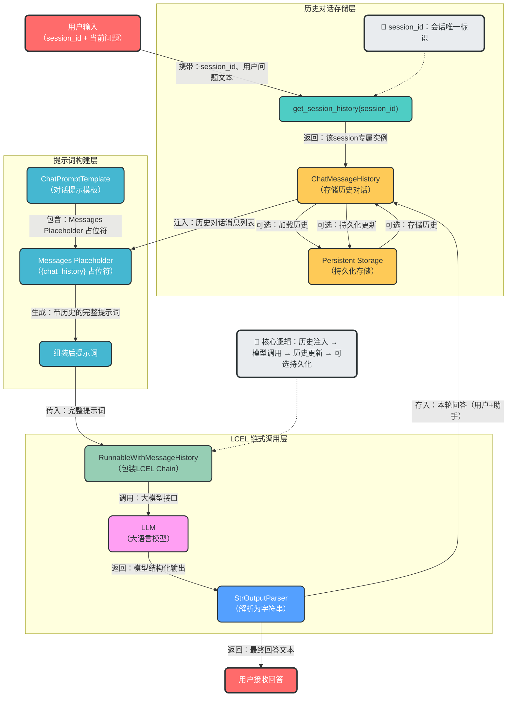

# LangChain 多轮对话能力实现

## 📁 实现文件

### 核心实现文件
- **multi_turn_conversation.py**：实现多轮对话核心功能
- **demo_multi_turn.py**：交互式演示脚本

## 🏗️ 架构设计

### 系统架构图


### 代码架构

```
├── ConversationConfig (配置管理)
│   ├── enable_persistence: 持久化开关（布尔值）
│   ├── data_dir: 存储目录路径
│   └── session_prefix: 会话ID前缀
│   ├── 工厂方法: with_persistence() / in_memory()
│
├── ConversationStore (存储管理)
│   ├── 内存模式: Dict[str, ChatMessageHistory]
│   └── 持久化模式: FileChatMessageHistory + JSON文件
│   ├── 核心方法: get_session_history()
│
└── MultiTurnConversationManager (核心管理器)
    ├── 依赖: RunnableWithMessageHistory（LCEL链封装）
    ├── 核心API:
    │   ├── create_session(): 创建新会话
    │   ├── chat(): 发送消息并获取回复
    │   ├── get_history(): 获取对话历史
    │   └── clear_history(): 清空历史
    └── 辅助方法: get_chain_with_history()
```

## 🚀 快速开始

### 1. 安装依赖

```bash
# 确保已安装项目依赖
pip install -r requirements.txt
# 或使用uv
uv sync
```

### 2. 配置环境变量

```bash
# 复制示例环境变量文件
cp .env.example .env
# 编辑.env文件，添加必要的API密钥
```

## ✨ 核心功能

### 1. 持久化开关

```python
from app.bailian.multi_turn_conversation import create_conversation_manager

# 内存模式（不支持持久化）
manager = create_conversation_manager(enable_persistence=False)

# 持久化模式
manager = create_conversation_manager(
    enable_persistence=True,
    data_dir="data/conversations"
)
```

### 2. 便捷配置方法

```python
from app.bailian.multi_turn_conversation import ConversationConfig

# 内存配置
config = ConversationConfig.in_memory()

# 持久化配置
config = ConversationConfig.with_persistence("data/conversations")

# 自定义配置
config = ConversationConfig(
    enable_persistence=True,
    data_dir="custom/path",
    session_prefix="user"
)
```

### 3. 完整使用示例

```python
from app.bailian.multi_turn_conversation import create_conversation_manager

# 创建对话管理器
manager = create_conversation_manager(
    enable_persistence=True,  # 开启持久化
    data_dir="data/conversations",  # 存储目录
    system_prompt="你是一个专业助手，擅长回答各种问题。"  # 系统提示词
)

# 创建会话
session_id = manager.create_session()
print(f"会话ID: {session_id}")

# 多轮对话
response1 = manager.chat("你好！", session_id)
print(f"助手: {response1}")

response2 = manager.chat("帮我写个Python快速排序算法", session_id)
print(f"助手: {response2}")

# 获取对话历史
history = manager.get_history(session_id)
print("\n对话历史:")
for msg in history:
    print(f"{msg['role']}: {msg['content']}")
```

## 📖 API 参考

### MultiTurnConversationManager

#### 创建对话管理器

```python
def create_conversation_manager(
    enable_persistence: bool = False,
    data_dir: str = "data/conversations",
    system_prompt: Optional[str] = None
) -> MultiTurnConversationManager:
    """创建对话管理器
    
    Args:
        enable_persistence: 是否启用持久化存储
        data_dir: 持久化存储目录
        system_prompt: 系统提示词
    
    Returns:
        MultiTurnConversationManager 实例
    """
```

#### 创建会话

```python
def create_session(self, session_id: Optional[str] = None) -> str:
    """创建新会话
    
    Args:
        session_id: 自定义会话ID，不提供则自动生成
    
    Returns:
        会话ID字符串
    """
```

#### 发送消息

```python
def chat(self, question: str, session_id: str, auto_save: bool = True) -> str:
    """发送消息并获取回复
    
    Args:
        question: 用户问题
        session_id: 会话ID
        auto_save: 是否自动保存对话历史（默认：True）
    
    Returns:
        助手回复字符串
    """
```

#### 获取对话历史

```python
def get_history(self, session_id: str) -> list:
    """获取对话历史
    
    Args:
        session_id: 会话ID
    
    Returns:
        对话历史列表，每个元素包含role和content字段
    """
```

#### 清空对话历史

```python
def clear_history(self, session_id: str) -> None:
    """清空对话历史
    
    Args:
        session_id: 会话ID
    """
```

## 🧪 运行测试

### 单元测试

```bash
# 运行所有测试
python app/bailian/test_multi_turn_conversation.py --test
```

### 交互式演示

```bash
# 运行对话示例
python app/bailian/multi_turn_conversation.py

# 运行持久化开关演示
python app/bailian/multi_turn_conversation.py --demo

# 运行交互式演示脚本
python app/bailian/demo_multi_turn.py
```

## 📄 持久化存储

### 存储格式

对话历史存储在 `data/conversations/{user_id}/{session_id}.json` 文件中，格式如下：

```json
[
  {
    "type": "human",
    "data": {
      "content": "你好",
      "additional_kwargs": {},
      "type": "human"
    }
  },
  {
    "type": "ai",
    "data": {
      "content": "你好！有什么可以帮你的？",
      "additional_kwargs": {},
      "type": "ai"
    }
  }
]
```

### 目录结构

```
data/
└── conversations/
    └── session/          # 根据session_id前缀自动创建
        └── session_xxx.json  # 会话ID对应的JSON文件
```

## 🔧 配置选项

| 配置项 | 类型 | 默认值 | 描述 |
|-------|------|--------|------|
| enable_persistence | bool | False | 是否启用持久化存储 |
| data_dir | str | "data/conversations" | 持久化存储目录 |
| session_prefix | str | "session" | 会话ID前缀 |
| system_prompt | str | "你是一个智能助手..." | 系统提示词 |

## 🌟 特性亮点

1. **灵活的持久化选项**：可随时切换内存模式和持久化模式
2. **简单易用的API**：提供简洁的接口，易于集成到现有项目
3. **会话管理**：支持多会话并发，每个会话独立存储
4. **完整的测试覆盖**：包含单元测试和演示脚本
5. **LangChain 1.2.4 兼容**：与项目中使用的LangChain版本完全兼容
6. **模块化设计**：代码结构清晰，易于扩展和维护

## 📝 注意事项

1. **API密钥配置**：使用前需要在 `.env` 文件中配置相应的API密钥
2. **存储目录权限**：确保程序对持久化存储目录有读写权限
3. **会话ID唯一性**：每个会话ID应唯一，避免冲突
4. **大模型费用**：使用大模型会产生费用，请合理使用
5. **历史记录大小**：长时间对话会导致历史记录变大，可能影响性能

## 🚀 扩展建议

1. **添加对话摘要功能**：对长对话进行摘要，减少历史记录大小
2. **支持多种存储后端**：如数据库、云存储等
3. **添加对话搜索功能**：支持搜索历史对话
4. **实现对话导出功能**：支持将对话导出为JSON、Markdown等格式
5. **添加用户认证**：实现用户级别的对话管理

## 🏆 最佳实践

1. **合理设置会话超时**：定期清理过期会话
2. **优化系统提示词**：根据具体场景调整系统提示词
3. **监控存储使用**：定期检查存储目录大小
4. **备份重要对话**：对重要对话进行定期备份
5. **限流措施**：添加API调用限流，避免过度使用

## 📄 许可证

MIT License

## 🤝 贡献

欢迎提交Issue和Pull Request！

## 📞 支持

如有问题，请提交Issue或联系项目维护者。

---

**更新时间**：2026-01-20
**版本**：1.0.0
**作者**：LangChain 开发团队