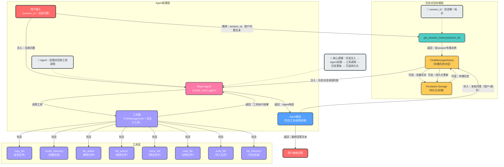
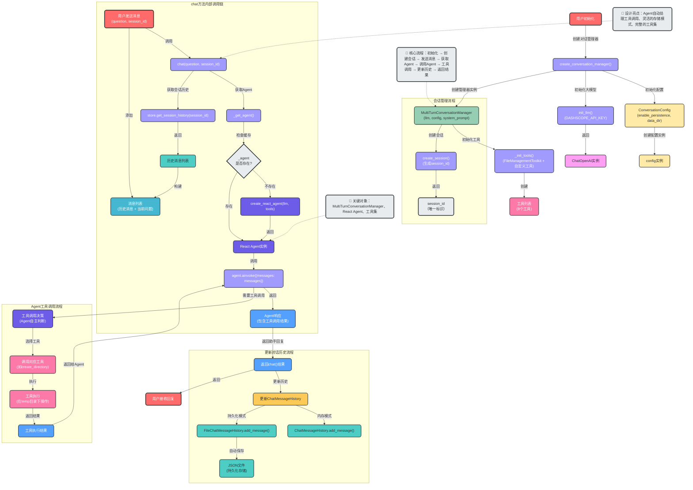

# LangChain 多轮对话 + Agent工具调用实现

## 📁 实现文件

### 核心实现文件
- **agent_multi_turn_conversation.py**：实现多轮对话核心功能，集成Agent工具调用
- **demo_multi_turn.py**：交互式演示脚本

## 🏗️ 架构设计

### 系统架构图


### 详细数据流图


### 代码架构

```
├── ConversationConfig (配置管理)
│   ├── enable_persistence: 持久化开关（布尔值）
│   ├── data_dir: 存储目录路径
│   └── session_prefix: 会话ID前缀
│   ├── 工厂方法: with_persistence() / in_memory()
│
├── ConversationStore (存储管理)
│   ├── 内存模式: Dict[str, ChatMessageHistory]
│   └── 持久化模式: FileChatMessageHistory + JSON文件
│   ├── 核心方法: get_session_history()
│
└── MultiTurnConversationManager (核心管理器)
    ├── 依赖: React Agent（create_react_agent）
    ├── 工具集: 8个文件管理工具
    ├── 核心API:
    │   ├── create_session(): 创建新会话
    │   ├── chat(): 发送消息并获取回复
    │   ├── get_history(): 获取对话历史
    │   └── clear_history(): 清空历史
    └── 辅助方法: _get_agent(), _init_tools()
```

## 🚀 快速开始

### 1. 安装依赖

```bash
# 确保已安装项目依赖
pip install -r requirements.txt
# 或使用uv
uv sync
```

### 2. 配置环境变量

```bash
# 复制示例环境变量文件
cp .env.example .env
# 编辑.env文件，添加必要的API密钥
```

## ✨ 核心功能

### 1. Agent工具调用

```python
from app.bailian.agent_multi_turn_conversation import create_conversation_manager

# 创建对话管理器
manager = create_conversation_manager(
    enable_persistence=True,
    data_dir="data/conversations",
    system_prompt="你是一个技术专家，擅长解决各种编程和技术问题。"
)

# 创建会话
session_id = manager.create_session()

# 使用工具创建目录和文件
response1 = manager.chat("在根目录下创建code_agent目录", session_id)
print(f"助手: {response1}")

response2 = manager.chat("在code_agent目录下创建.keep文件", session_id)
print(f"助手: {response2}")

# 验证文件创建
response3 = manager.chat("查看code_agent目录下的文件", session_id)
print(f"助手: {response3}")
```

### 2. 持久化开关

```python
from app.bailian.agent_multi_turn_conversation import create_conversation_manager

# 内存模式（不支持持久化）
manager = create_conversation_manager(enable_persistence=False)

# 持久化模式
manager = create_conversation_manager(
    enable_persistence=True,
    data_dir="data/conversations"
)
```

### 3. 多轮对话

```python
from app.bailian.agent_multi_turn_conversation import create_conversation_manager

# 创建对话管理器
manager = create_conversation_manager(
    enable_persistence=True,
    system_prompt="你是一个智能助手，擅长帮助用户解决各种问题。"
)

# 创建会话
session_id = manager.create_session()

# 第一轮对话
response1 = manager.chat("你好！", session_id)
print(f"助手: {response1}")

# 第二轮对话，使用工具
response2 = manager.chat("帮我在根目录下创建一个test目录", session_id)
print(f"助手: {response2}")

# 第三轮对话，继续使用工具
response3 = manager.chat("在test目录下创建一个README.md文件，内容为'Hello World'", session_id)
print(f"助手: {response3}")

# 第四轮对话，查看结果
response4 = manager.chat("查看test目录下的文件和内容", session_id)
print(f"助手: {response4}")
```

## 📖 API 参考

### MultiTurnConversationManager

#### 创建对话管理器

```python
def create_conversation_manager(
    enable_persistence: bool = False,
    data_dir: str = "data/conversations",
    system_prompt: Optional[str] = None
) -> MultiTurnConversationManager:
    """创建对话管理器
    
    Args:
        enable_persistence: 是否启用持久化存储
        data_dir: 持久化存储目录
        system_prompt: 系统提示词
    
    Returns:
        MultiTurnConversationManager 实例
    """
```

#### 创建会话

```python
def create_session(self, session_id: Optional[str] = None) -> str:
    """创建新会话
    
    Args:
        session_id: 自定义会话ID，不提供则自动生成
    
    Returns:
        会话ID字符串
    """
```

#### 发送消息

```python
def chat(self, question: str, session_id: str, auto_save: bool = True) -> str:
    """发送消息并获取回复
    
    Args:
        question: 用户问题
        session_id: 会话ID
        auto_save: 是否自动保存对话历史（默认：True）
    
    Returns:
        助手回复字符串
    """
```

#### 获取对话历史

```python
def get_history(self, session_id: str) -> list:
    """获取对话历史
    
    Args:
        session_id: 会话ID
    
    Returns:
        对话历史列表，每个元素包含role和content字段
    """
```

#### 清空对话历史

```python
def clear_history(self, session_id: str) -> None:
    """清空对话历史
    
    Args:
        session_id: 会话ID
    """
```

## 🧰 工具集参考

| 工具名称 | 描述 | 参数 |
|---------|------|------|
| copy_file | 在指定位置创建文件的副本 | source_path, destination_path |
| create_directory | 创建目录，如果目录已存在则忽略 | path |
| file_delete | 删除一个文件 | file_path |
| file_search | 在子目录中递归搜索与正则表达式模式匹配的文件 | directory, pattern |
| move_file | 将文件从一个位置移动到另一个位置，或者重命名文件 | source_path, destination_path |
| read_file | 从磁盘读取文件内容 | file_path |
| write_file | 将文件写入磁盘，可以选择追加到现有文件 | file_path, text, append=False |
| list_directory | 列出指定文件夹中的文件 | directory |

## 🧪 运行测试

### 单元测试

```bash
# 运行所有测试
python app/bailian/test_multi_turn_conversation.py --test
```

### 交互式演示

```bash
# 运行对话示例
python app/bailian/agent_multi_turn_conversation.py

# 运行持久化开关演示
python app/bailian/agent_multi_turn_conversation.py --demo

# 运行工具调用测试
python test_create_directory.py
```

## 📄 持久化存储

### 存储格式

对话历史存储在 `data/conversations/{user_id}/{session_id}.json` 文件中，格式如下：

```json
[
  {
    "type": "human",
    "data": {
      "content": "在根目录下创建code_agent目录",
      "additional_kwargs": {},
      "type": "human"
    }
  },
  {
    "type": "ai",
    "data": {
      "content": "已在根目录下创建 `code_agent` 目录。",
      "additional_kwargs": {},
      "type": "ai"
    }
  }
]
```

### 目录结构

```
data/
└── conversations/
    └── session/          # 根据session_id前缀自动创建
        └── session_xxx.json  # 会话ID对应的JSON文件
```

## 🔧 配置选项

| 配置项 | 类型 | 默认值 | 描述 |
|-------|------|--------|------|
| enable_persistence | bool | False | 是否启用持久化存储 |
| data_dir | str | "data/conversations" | 持久化存储目录 |
| session_prefix | str | "session" | 会话ID前缀 |
| system_prompt | str | "你是一个智能助手..." | 系统提示词，包含工具说明 |

## 🌟 特性亮点

1. **Agent自动工具调用**：使用React Agent自动处理工具调用，无需手动编写工具调用逻辑
2. **完整的文件管理工具集**：提供8个文件管理工具，满足基本文件操作需求
3. **灵活的持久化选项**：可随时切换内存模式和持久化模式
4. **简单易用的API**：提供简洁的接口，易于集成到现有项目
5. **会话管理**：支持多会话并发，每个会话独立存储
6. **模块化设计**：代码结构清晰，易于扩展和维护
7. **LangChain兼容**：与项目中使用的LangChain版本完全兼容

## 📝 注意事项

1. **API密钥配置**：使用前需要在 `.env` 文件中配置相应的API密钥
2. **存储目录权限**：确保程序对持久化存储目录有读写权限
3. **会话ID唯一性**：每个会话ID应唯一，避免冲突
4. **大模型费用**：使用大模型会产生费用，请合理使用
5. **历史记录大小**：长时间对话会导致历史记录变大，可能影响性能
6. **工具执行目录**：所有工具操作都在 `e:/github_project/imooc_agent/.temp` 目录下执行

## 🚀 扩展建议

1. **添加更多自定义工具**：根据业务需求添加更多工具
2. **支持工具权限管理**：为不同用户或会话设置不同的工具使用权限
3. **添加工具调用日志**：记录工具调用历史，便于调试和审计
4. **支持工具结果缓存**：对相同参数的工具调用结果进行缓存，提高性能
5. **添加对话摘要功能**：对长对话进行摘要，减少历史记录大小
6. **支持多种存储后端**：如数据库、云存储等

## 🏆 最佳实践

1. **合理设置会话超时**：定期清理过期会话
2. **优化系统提示词**：根据具体场景调整系统提示词，明确工具使用方式
3. **监控工具调用频率**：避免频繁调用工具导致性能问题
4. **备份重要对话**：对重要对话进行定期备份
5. **限流措施**：添加API调用限流，避免过度使用
6. **测试工具调用**：在生产环境使用前，充分测试工具调用逻辑

## 📄 许可证

MIT License

## 🤝 贡献

欢迎提交Issue和Pull Request！

## 📞 支持

如有问题，请提交Issue或联系项目维护者。

---

**更新时间**：2026-01-21
**版本**：2.0.0
**作者**：LangChain 开发团队