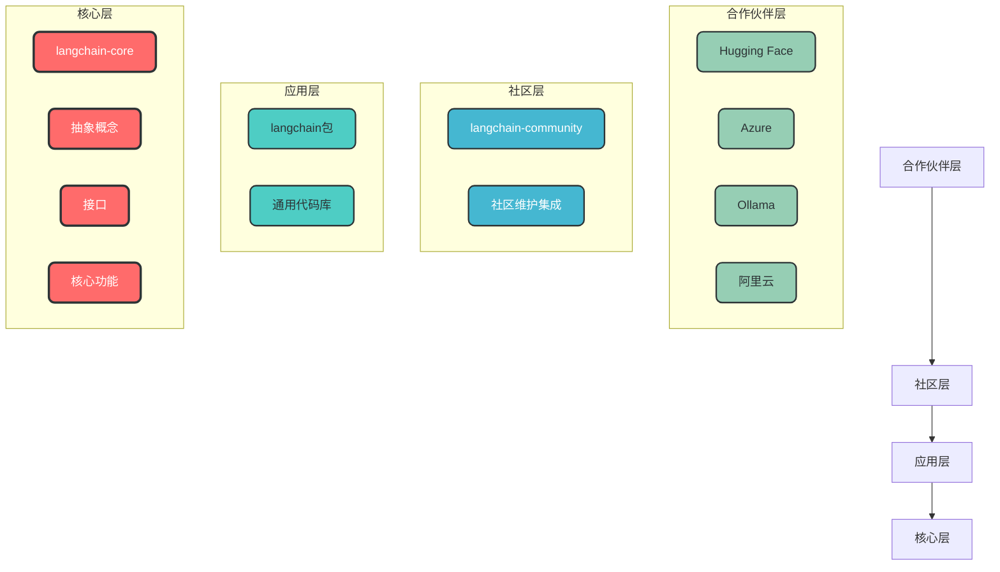
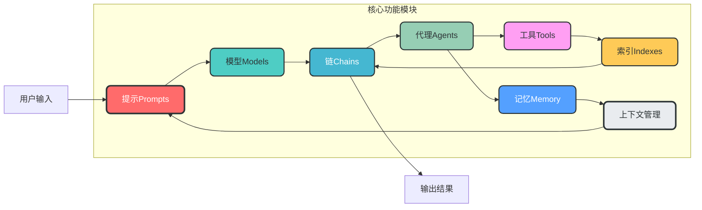
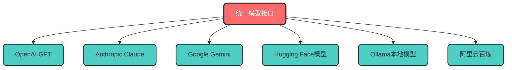
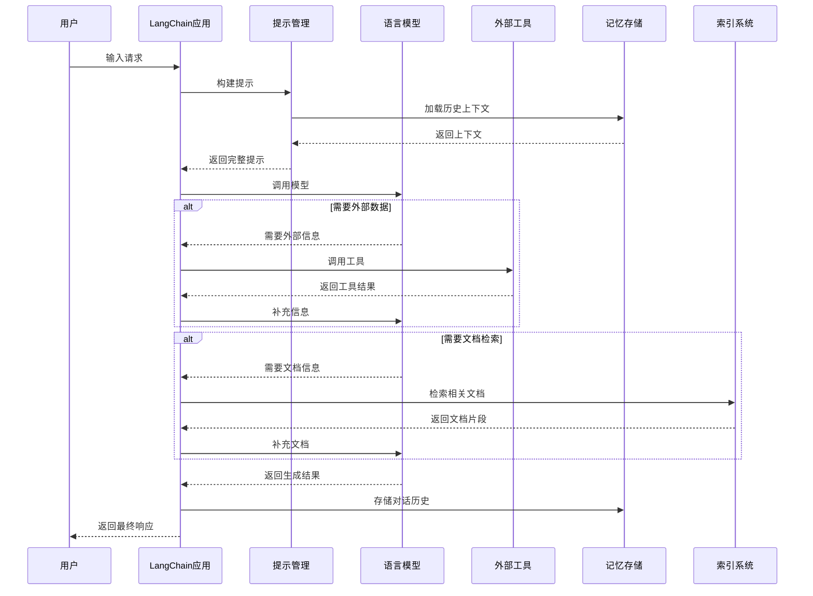

# LangChain框架介绍

## 1. LangChain简介

LangChain是一个开源的标准化框架，旨在简化基于大型语言模型（LLM）的应用程序开发流程。通过提供模块化的组件和工具，将LLM与其他数据源、工具和计算资源无缝连接，使开发者能够更高效地构建复杂AI应用。

自2022年10月首次发布以来，LangChain已迅速成为GitHub上增长最快的开源项目之一。2024年1月，LangChain发布首个稳定版本0.1.0，目前已更新至0.3版本。

### 1.1 官网与源码地址

| 版本 | 官网地址 | 源码地址 |
|------|----------|----------|
| Python | [https://python.langchain.com/](https://python.langchain.com/) | [https://github.com/langchain-ai/langchain](https://github.com/langchain-ai/langchain) |
| Node.js | [https://js.langchain.com/](https://js.langchain.com/) | [https://github.com/langchain-ai/langchainjs](https://github.com/langchain-ai/langchainjs) |

## 2. 发展现状

LangChain目前已成为一个成熟且活跃的开源项目，拥有强大的社区支持和丰富的功能扩展。截至2025年5月，LangChain的Python主仓库GitHub Star数已超过10万，成为GitHub上增长最快的AI开源项目之一。同时，其Java版本LangChain4j也于2025年初开始活跃，3月更新了多个仓库（如JeecgBoot、LangChain4j-aideepin等），5月发布了1.0-Beta3版本，接近正式版本。

## 3. 项目架构

LangChain采用分层架构设计，从核心到应用形成清晰的层次结构：



### 3.1 架构分层说明

| 层级 | 主要内容 | 特点 |
|------|----------|------|
| **核心层** | langchain-core包含主要的抽象概念、接口和核心功能 | 代码非常稳定，提供基础框架 |
| **应用层** | langchain包提供通用代码库 | 适用于不同接口实现，提供通用功能 |
| **社区层** | langchain-community包含大量由社区维护的轻量级集成 | 扩展丰富，社区驱动 |
| **合作伙伴层** | 与Hugging Face、Azure、Ollama、阿里云等企业合作推出专用集成包 | 官方合作，优化支持 |

## 4. 核心功能

LangChain的核心功能模块包括：模型（Models）、提示（Prompts）、链（Chains）、代理（Agents）、记忆（Memory）和索引（Indexes）。



### 4.1 核心功能模块详解

#### 4.1.1 模型（Models）
提供统一接口调用各种LLM，如OpenAI的GPT系列、Anthropic的Claude系列、Google的Gemini系列，以及Hugging Face的开源模型。



#### 4.1.2 提示（Prompts）
优化模型输入，提升生成结果的质量，包括PromptTemplate、ChatPromptTemplate和FewShotPromptTemplate等。

#### 4.1.3 链（Chains）
封装多个组件的调用序列，创建复杂的工作流程，如SimpleSequentialChain等。

#### 4.1.4 代理（Agents）
允许模型自主调用外部工具和组件，实现多步骤任务处理，如AutoGPT和BabyAGI。

#### 4.1.5 记忆（Memory）
存储和检索对话数据，支持上下文感知的应用，如多轮对话系统。

#### 4.1.6 索引（Indexes）
组织和检索文档数据，支持RAG（检索增强生成）等应用场景。

## 5. 数据流程

LangChain应用的数据流程通常包括以下步骤：



## 6. 应用场景

LangChain适用于多种AI应用场景：

1. **智能对话系统**：构建具有上下文记忆的聊天机器人
2. **检索增强生成（RAG）**：结合外部知识库回答问题
3. **自动化工作流**：通过代理自主完成复杂任务
4. **多模态应用**：处理文本、图像、音频等多种数据类型
5. **代码生成与分析**：辅助软件开发和代码理解
6. **教育与培训**：个性化学习助手和内容生成

## 7. 快速开始

### 7.1 Python版本安装

```bash
# 安装核心包
pip install langchain-core

# 安装完整包
pip install langchain

# 安装特定集成（如Ollama）
pip install langchain-ollama
```

### 7.2 简单示例

```python
from langchain_ollama import ChatOllama
from langchain_core.messages import HumanMessage

# 初始化模型
llm = ChatOllama(model="gemma3:1b")

# 发送消息
response = llm.invoke([HumanMessage(content="你好！")])

# 打印结果
print(response.content)
```

## 8. 总结

LangChain作为一个成熟的LLM应用框架，提供了丰富的组件和工具，简化了AI应用的开发流程。其分层架构设计确保了框架的稳定性和扩展性，而核心功能模块则覆盖了LLM应用开发的主要场景。随着社区的不断发展和企业合作的深入，LangChain将继续成为构建复杂AI应用的重要工具。